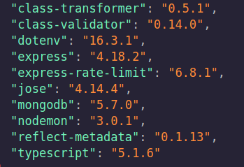

# Reto de alquileres con MongoDB

## Base de datos


## Dependencias implementadas




## Instrucciones

Para usar este proyecto primero tienes que usar la version 18.16.1 de nvm.
Una vez tengas la version en uso, por la terminal debes mandar el comando `npm i`

Lo siguiente seria la configuracion de las variables de entorno, puedes eliminar la parte `.example` del archivo .env.example y luego llenas los campos vacios con sus datos correspondientes.

Ahora vamos a iniciar la transcompilacion del DTO con el comando `npm run tsc`, despues vamos a arrancar nodemon en una terminal diferente con el comando `npm start`. 
Recuerda que para que funcione correctamente debes tener las 2 terminales abiertas al mismo tiempo.


## Base de datos

Para crear la base de datos primero debes dirigiste a la carpeta `db`, ahora primero crearemos los esquemas de las colecciones que estan en el archivo `schema_SQL.mongodb`.
Una vez termines de crear los esquemas ahora si vamos a ir a los insert de cada coleccion que se encuentran en el archivo `mod_SQL.mongodb`.

## Endpoints

Ahora si vamos a utilizar los endpoints para realizar las consultas de nuestra base de datos en mongoDB.

### Tokens

Antes de realizar las consultas tienes que generar el token correspondiente, hay un total de 4 tokens que se generan con los siguientes enpoints
```
http://127.10.10.10:7500/token/alquileres
http://127.10.10.10:7500/token/autos
http://127.10.10.10:7500/token/clientes
http://127.10.10.10:7500/token/empleados
```
